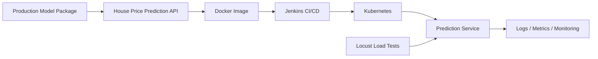

# Production ML Deployment — Docker, Kubernetes, Jenkins & Load Testing

A hands-on **production ML deployment / MLOps engineering project** covering model packaging, API serving, containerization, Kubernetes deployment, CI/CD, and load-testing concepts.

> Portfolio context: this repository represents practical deployment engineering that supports my current work as a **Lead Data & AI Architect** across enterprise Data Platforms, MLOps/LLMOps, GenAI, Agentic AI, cloud architecture, governance, and observability.

## Architecture

## Repository evidence

This repository includes deployment-oriented assets such as:

- `production-model-package/` — packaged model/application components
- `house-prices-api/` — prediction API layer
- `Dockerfile` — container image definition
- `Jenkinsfile` — CI/CD pipeline definition
- `deployment.yaml` and `pod.yaml` — Kubernetes deployment assets
- `locustfile.py` — performance/load-testing workload
- `Makefile` — repeatable engineering commands

## What this project demonstrates

| Capability | Architecture relevance |
| --- | --- |
| Model packaging | Reproducible ML artifacts and dependency boundaries |
| API serving | Production inference interface |
| Docker | Portable runtime packaging |
| Jenkins | Automated build/deployment workflow |
| Kubernetes | Container orchestration and deployment model |
| Locust | Load/performance testing before production scaling |
| Makefile | Repeatable developer and automation commands |

## Production-readiness considerations

A modern enterprise implementation should additionally make these controls explicit:

- Automated unit, integration and inference-contract tests
- Immutable/versioned model and container artifacts
- Dependency and container vulnerability scanning
- Secrets management and workload identity
- Readiness/liveness probes and autoscaling
- Resource requests/limits
- Environment promotion policies
- Canary/blue-green deployment and rollback
- Model/data drift monitoring
- Centralized logs, metrics and distributed traces
- SLOs for latency, availability and error rate
- Cost and capacity monitoring

## From MLOps to LLMOps / Agentic AI

These deployment fundamentals carry directly into modern AI platforms. GenAI systems additionally need prompt/model/tool versioning, RAG evaluation, agent traces, state/memory governance, safety evaluation, human approval, and auditable tool execution.

## Technology focus

**Python · Docker · Kubernetes · Jenkins · CI/CD · MLOps · REST API · Model Serving · Locust · Performance Testing · Production ML · LLMOps**

---

### Keywords

`MLOps` · `Kubernetes` · `Docker` · `Jenkins` · `CI/CD` · `Model Deployment` · `Model Serving` · `REST API` · `Load Testing` · `Locust` · `Production ML` · `AI Platform` · `LLMOps` · `AI Architecture`